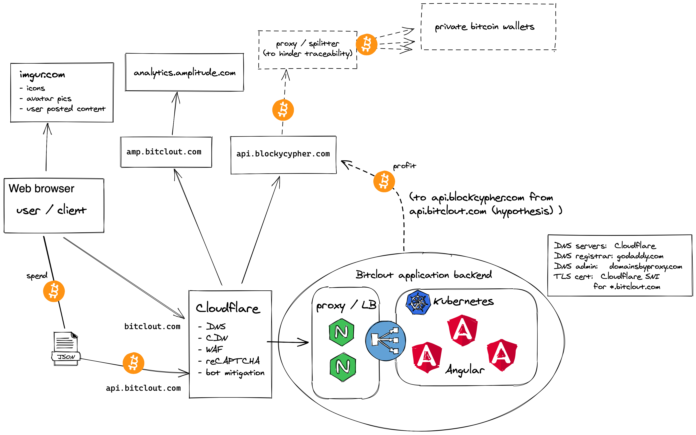

# bitclout
Source and docs

Bitclout is a scam if considered or sold as a financial investment.  Bitclout is more of a game or a vending machine that accepts Bitcoin irreversibly in exchange for a game currency called Bitclout and a token called BitcloutCoin.  You can buy a token with a Bitclout.  You can buy either with Bitcoin.  There is no way to get Bitcoin back from the system nor is there any declaration of intention to ever make that happen in the one pager or the terms and conditions.  Bitclout is a game and it costs Bitcoin to play (and a valid phone number).

This project gathers information about Bitclout's code, APIs, 3rd party integrations and architecture.

Related work (began as a Reddit thread in r/Bitclout):
https://www.reddit.com/r/BitClout/comments/mhpwjx/reverse_engineering_bitclout/

Bitclout Architecture Digram (work in progress)

